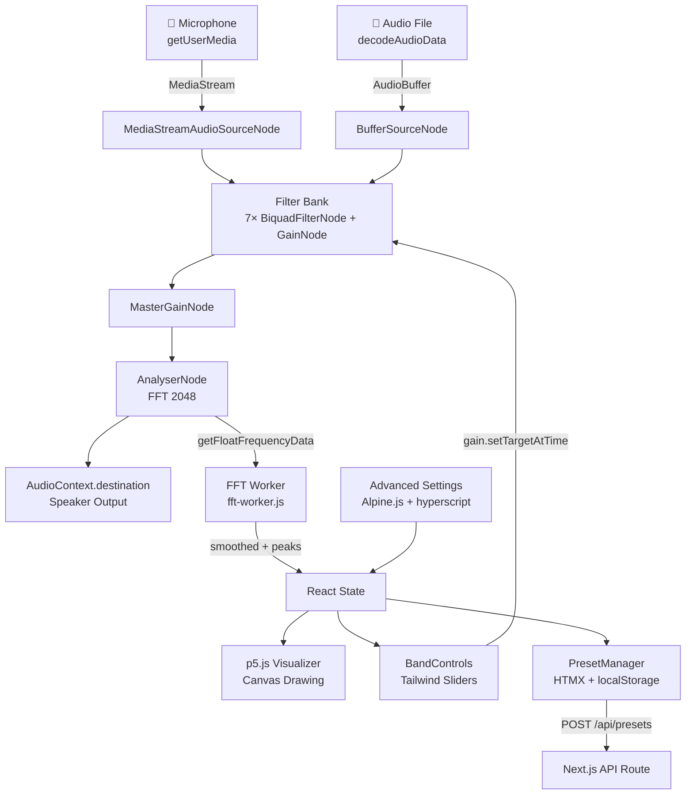
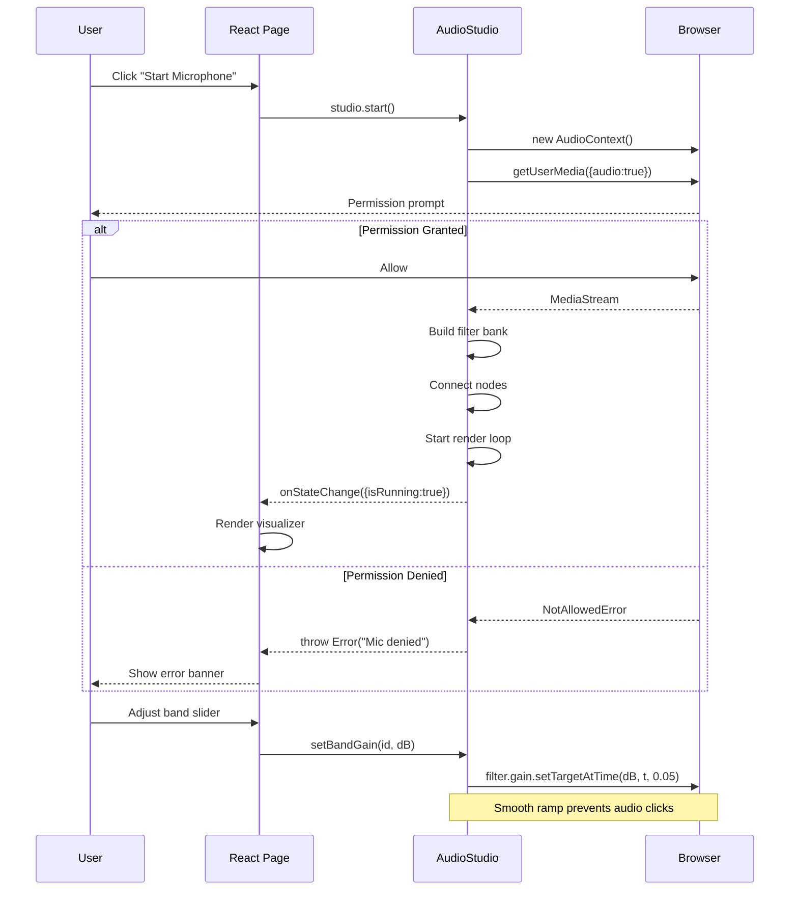

# Equalizer Studio

A production-ready, browser-based audio equalizer and FFT visualizer built with Next.js, p5.js, Alpine.js, HTMX, hyperscript, Vue.js, and Tailwind CSS.

**Author:** Hirotoshi Uchida  
**License:** MIT

---

## Architecture



---

## Initialization & Permission Flow



---

## Directory Structure

```
equalizer-studio/
├── package.json
├── next.config.js
├── tailwind.config.js
├── postcss.config.js
├── tsconfig.json
├── vercel.json
├── README.md
├── public/
│   ├── about.html
│   └── workers/
│       └── fft-worker.js          # Off-thread EMA + peak detection
└── src/
    ├── app/
    │   ├── globals.css
    │   ├── layout.tsx              # CDN: HTMX + Alpine + hyperscript
    │   ├── page.tsx                # Redirect → /audio-studio
    │   ├── audio-studio/
    │   │   └── page.tsx            # Main studio page (Client Component)
    │   └── api/
    │       └── presets/
    │           ├── route.ts        # GET / POST / DELETE presets
    │           └── settings/
    │               └── route.ts    # HTMX settings endpoint
    ├── components/
    │   ├── P5Visualizer.tsx        # p5.js canvas (dynamic import, no SSR)
    │   ├── BandControls.tsx        # 7-band vertical sliders + master gain
    │   └── PresetManager.tsx       # Save / load / delete presets
    └── lib/
        ├── audioStudio.ts          # Core audio engine (singleton)
        └── constants.ts            # Band definitions, FFT constants
```

---

## FFT Smoothing & Peak Detection — Mathematics

### Exponential Moving Average (EMA) Smoothing

Raw FFT output is noisy frame-to-frame. An EMA smooths the magnitude spectrum without introducing phase distortion:

$$S_n = \alpha \cdot \left| X_n[k] \right| + (1 - \alpha) \cdot S_{n-1}[k]$$

where:
- $S_n[k]$ — smoothed magnitude at bin $k$ for frame $n$
- $X_n[k]$ — raw FFT magnitude at bin $k$
- $\alpha \in (0, 1)$ — smoothing factor (implementation uses $\alpha = 0.2$; lower values give heavier smoothing)

### Frequency Resolution

The frequency represented by bin $k$ for an FFT of size $N$ and sample rate $f_s$:

$$f_k = k \cdot \frac{f_s}{N}$$

The frequency resolution (spacing between adjacent bins) is $\Delta f = f_s / N$. For $N = 2048$ and $f_s = 48\,000\,\text{Hz}$: $\Delta f \approx 23.4\,\text{Hz/bin}$.

### Peak Detection

A local maximum at bin $k$ is classified as a **spectral peak** when:

$$S_n[k] > S_n[k-1] \quad \wedge \quad S_n[k] > S_n[k+1] \quad \wedge \quad S_n[k] > \mu + \beta\sigma$$

where:
- $\mu = \text{median}\{S_n[k]\}$ — background noise floor estimate
- $\sigma = \text{std}\{S_n[k]\}$ — spectral variance (implementation uses population std-dev over all bins)
- $\beta$ — sensitivity multiplier (implementation uses $\beta = 1.4$); increase to reduce false positives

Up to $K_{\max} = 6$ peaks are returned, ranked by magnitude.

### Per-Band Gain Ramping

To prevent audible clicks when changing gain, the implementation uses the Web Audio API's `setTargetAtTime`:

$$g(t) = g_{\text{target}} + (g_{\text{prev}} - g_{\text{target}}) \cdot e^{-(t - t_0)/\tau}$$

where $\tau = 0.05\,\text{s}$ is the time constant (one time constant ≈ 63% of the way to the target).

---

## Technology Stack

| Layer | Technology | Role |
|---|---|---|
| Framework | Next.js 14 (App Router) | Routing, SSR, API routes |
| Drawing | p5.js 1.9 | Canvas visualization (spectrum, waveform, peaks) |
| Audio | Web Audio API | AudioContext, filter bank, analyser |
| UI (micro) | Alpine.js 3 | Inline reactive UI (settings panel, toggles) |
| UI (fetch) | HTMX 1.9 | Declarative server interactions (preset save) |
| UI (events) | hyperscript 0.9 | Tiny inline behaviors (toggle, keyboard) |
| Styling | Tailwind CSS 3 | Utility-first design system |
| Types | TypeScript 5 | End-to-end type safety |

---

## Getting Started

```bash
npm install
npm run dev
```

Open [http://localhost:3000](http://localhost:3000) — you will be redirected to `/audio-studio`.

### Production Build

```bash
npm run build
npm start
```

### Deploy to Vercel

```bash
vercel deploy
```

---

## Manual QA Checklist

The following tests must be run manually because microphone permissions cannot be automated in CI.

**Desktop Chrome** — confirm mic permission prompt appears, live FFT spectrum renders, band slider changes produce audible gain change, Stop button correctly tears down AudioContext.

**iOS Safari (HTTPS required)** — verify that AudioContext only activates on user gesture, confirm sample rate calibration detects 44100 Hz or 48000 Hz correctly, test drag-and-drop of an audio file as a fallback.

**Android Chrome** — verify the visualizer renders correctly, switch tab to background and confirm throttled rendering resumes on foreground return, enable Low Power mode to reduce FFT size and confirm reduced CPU usage.

**Low-end device** — enable Low Power mode before starting, verify fftSize drops to 512 with adequate visual quality, confirm the app does not crash under sustained use.

**Fallback (mic denied)** — deny microphone permission, confirm the error banner displays the correct message, confirm the audio file upload path works as an alternative.

---

## Browser Compatibility

| Platform | Status | Notes |
|---|---|---|
| Chrome 90+ (Desktop) | ✅ Full | Reference browser |
| Edge 90+ (Chromium) | ✅ Full | Identical to Chrome |
| Firefox 90+ | ✅ Full | Slight AudioWorklet differences; handled |
| Safari 14.1+ (macOS) | ✅ Full | Requires HTTPS for getUserMedia |
| Safari (iOS 14.5+) | ✅ Full | Requires user gesture; HTTPS mandatory |
| Android Chrome | ✅ Full | Enable Low Power mode on older devices |
| Samsung Internet 14+ | ✅ Mostly | Test manually for WebAudio quirks |
| Windows (Chromium 109) | ⚠️ Limited | Windows 7/8.1; older API surface |
